# Detroit Cyber Ready

**Know when your city is at risk, before an incident becomes an outage.**

Built for the Venture 313 AI Buildathon, September 2026. Live: **https://detroit-cyber-ready-web.vercel.app**

| | |
|---|---|
| **Primary pillar** | **Open, Accessible & Responsible Government** (Rise Higher survey: *Open and Accessible Government*) |
| **Secondary pillar** | **Safe, Just & Thriving Neighborhoods** (Rise Higher survey: *Safe and Just Communities*) |
| **Rise Higher questions answered** | *Access to City Services* and *Trust in City Government*, answer by answer, [below](#1-alignment-to-the-rise-higher-detroit-survey) |
| **What it does** | Watches live threat intelligence, finds which Detroit city service a new exploit could take offline, investigates it with AI agents, and hands the CISO a ranked action plan |

---

## 1. Alignment to the Rise Higher Detroit survey

[Rise Higher Detroit](https://www.risehigherdetroit.com/rise-higher-detroit) is the City's process for translating community priorities into City policy. Nearly 300 community leaders on the Sheffield Transition Committee designed the survey, and more than 9,000 residents answered 19 questions about what they want and need from City government.

Two of those questions sit inside our primary pillar. Residents answered both with the same message: **make City services easier to reach, and give us reasons to trust the government running them.**

Every answer below assumes one thing residents never see: that the City's systems are up and secure when they reach for them. A service that is offline cannot be accessed, and a City that learns about a breach from the news does not earn trust. **Detroit Cyber Ready is the part of that promise that happens before the outage.**

For each answer we state how the product serves it:

- **Direct:** the product protects or produces that thing today.
- **Enabling:** the product keeps the systems that answer depends on running.

Answers the product does not address are listed as not claimed.

### Question 1: Access to City Services

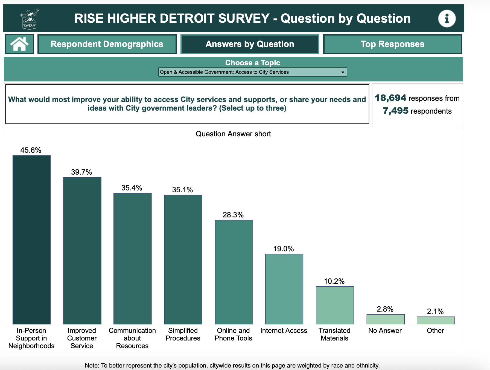

> *What would most improve your ability to access City services and supports, or share your needs and ideas with City government leaders?* 18,694 responses from 7,495 respondents.

| Residents asked for | Share | How Detroit Cyber Ready serves it | Link |
|---|---|---|---|
| **In-Person Support in Neighborhoods** | **45.6%** | In-person help at libraries, parks, and health offices still runs on City systems for records, sign-in, and payments. The dashboard maps these sites at their real addresses and flags the moment one of them is exposed. | Enabling |
| **Improved Customer Service** | **39.7%** | The worst service experience is a system that is down. Every finding states in plain language what residents will feel, so staff can act before the service fails. | Enabling |
| **Communication about Resources** | **35.4%** | Each investigation produces a resident-impact statement and an incident ticket the City can use to tell residents what is affected and what is being done. | Enabling |
| **Online and Phone Tools** | **28.3%** | The online and phone channels residents named are services the product watches: online Payments and the 911 phone line are both in the monitored inventory. When a newly exploited vulnerability reaches the systems behind them, the security team gets a ranked plan in under a minute of investigation. | **Direct** |

Not claimed: Simplified Procedures (35.1%), Internet Access (19.0%), Translated Materials (10.2%). These are real priorities, but a security product does not deliver them.

### Question 2: Trust in City Government

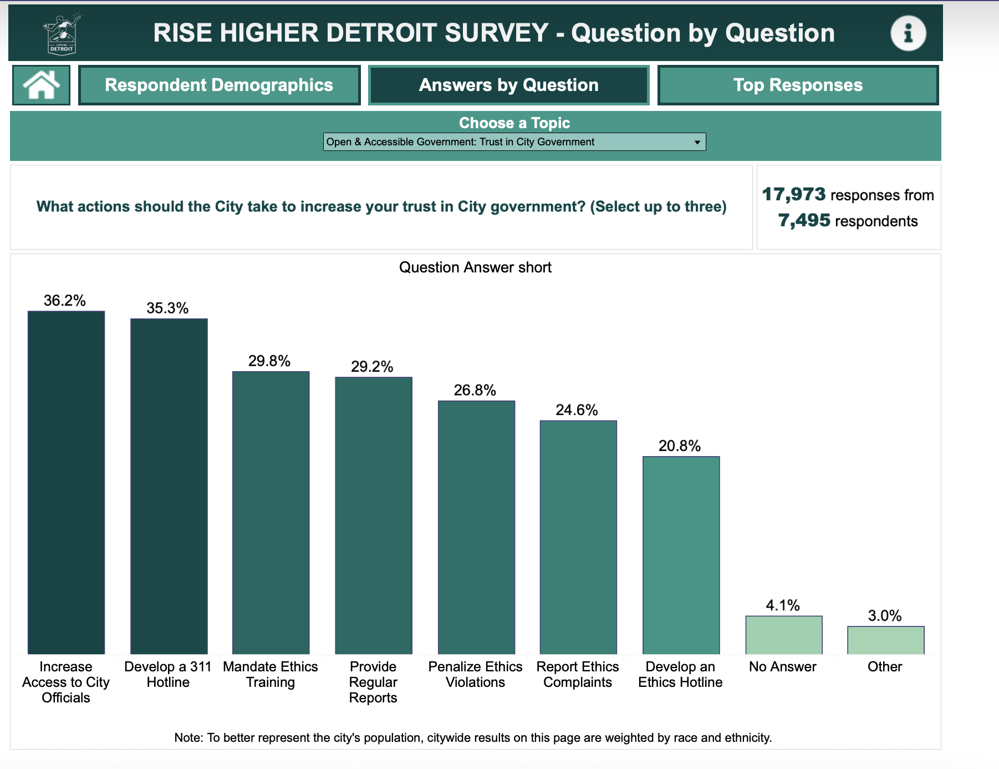

> *What actions should the City take to increase your trust in City government?* 17,973 responses from 7,495 respondents.

| Residents asked for | Share | How Detroit Cyber Ready serves it | Link |
|---|---|---|---|
| **Develop a 311 Hotline** | **35.3%** | A 311 line would run on the same shared identity, network, and remote-access systems the product already watches. Protecting it is one new entry in the service inventory (`data/detroit/services.yaml`), not new software. | Enabling |
| **Provide Regular Reports** | **29.2%** | Reporting is the product's output. Every investigation is kept in a running history with an incident ticket. Every alert shows exactly why a service was flagged: the match is an auditable database row, not a model's guess. | **Direct** |

Trust is also built into how the product behaves:

- It labels simulated data on every screen.
- It never says "you are being hacked" when the evidence only supports "potential exposure."
- It keeps the decision about whether Detroit is exposed deterministic and auditable. The AI explains and prioritizes; it does not decide.

Not claimed: Increase Access to City Officials (36.2%), and the ethics items (training 29.8%, penalties 26.8%, complaint reporting 24.6%, hotline 20.8%).

### Secondary pillar: Safe and Just Communities

The survey's *Safe and Just Communities* pillar includes *Neighborhood Safety*, and neighborhood safety depends on emergency response reaching people. The product is anchored on **911 Emergency Communications**. 911 sits in its own life-safety tier, above critical. A hard-coded escalation rule makes any actively exploited path to 911 a P1, and no score can argue it down. Police is also a monitored service.

<details>
<summary>Rise Higher top responses across all pillars</summary>

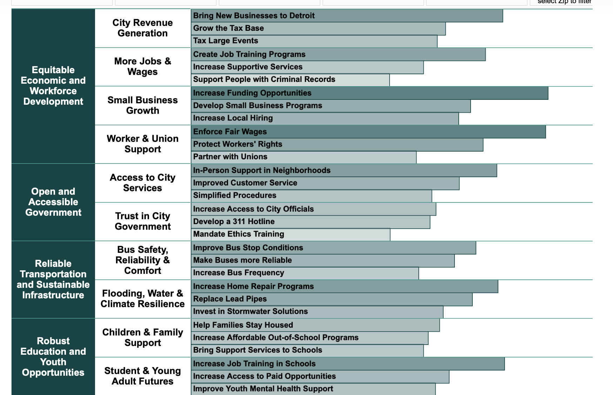

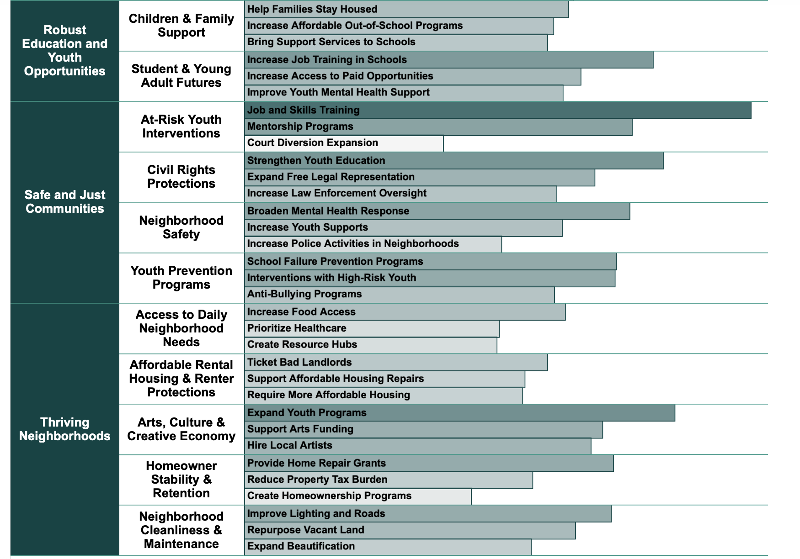

</details>

Survey images are from the City of Detroit's public [Rise Higher Detroit](https://www.risehigherdetroit.com/rise-higher-detroit) dashboard. Citywide results are weighted by race and ethnicity, per the City's note.

### Pillar map

The buildathon names six challenge areas. We claim one as primary and one as secondary, and no others.

| # | Buildathon pillar | Rise Higher survey pillar | Our claim |
|---|---|---|---|
| 04 | **Open, Accessible & Responsible Government** | Open and Accessible Government | **Primary** |
| 01 | **Safe, Just & Thriving Neighborhoods** | Safe and Just Communities | **Secondary** |
| 02 | Community & Public Health | | Not claimed (Public Health is one of the 12 services protected) |
| 03 | Reliable Transportation, Infrastructure & Sustainability | Reliable Transportation and Sustainable Infrastructure | Not claimed (DDOT and Water are protected services) |
| 05 | Future of Education & Youth Opportunities | Robust Education and Youth Opportunities | Not claimed |
| 06 | Future of Detroit | | Not claimed |

---

## 2. How we meet the judging criteria

### 01 Pillar relevance: build to a pillar, or you're out

- **Meets:** one named primary pillar, *Open, Accessible & Responsible Government*, and one named secondary pillar, *Safe, Just & Thriving Neighborhoods*.
- **Exceeds:**
  - Both Rise Higher questions in our pillar are mapped above, answer by answer, with the survey's own percentages.
  - Each answer is labeled as a direct or enabling link.
  - Answers we do not serve are listed as not claimed.

### 02 Problem: real, compelling, provable pain

<!-- Team: expanded Problem details to come. -->

A sitting municipal CISO described it this way:

> "I have Tenable and other tools. I don't care about vulnerabilities. I want to be alerted if something is proactive."

A city of Detroit's size already owns vulnerability scanners, often more than one. What it does not own is the layer above them: something that notices when a change in the outside world makes an existing exposure urgent, investigates it without a human, and says which city service is at risk.

### 03 Solution: elegant, repeatable, scalable, and people build habits around it

<!-- Team: expanded Solution details to come. -->

> Tenable tells Detroit what is vulnerable. Detroit Cyber Ready tells Detroit when something changes that could matter right now, investigates it automatically, determines which city service could be affected, and tells the team what to do next.

See [How it works](#how-it-works).

### 04 Product: it does the thing, or has a credible path to it

It does the thing, live, at **https://detroit-cyber-ready-web.vercel.app**. The dashboard walks through six steps, all running on the real pipeline:

1. **All clear:** the board shows 12 city services on a street map of Detroit.

   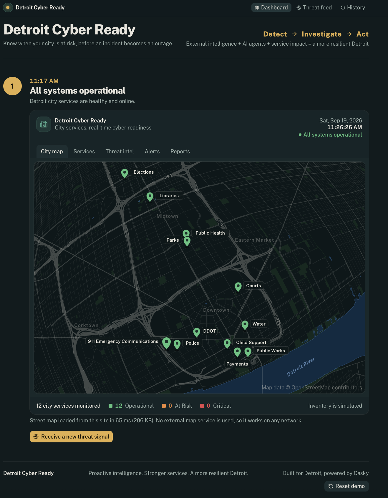

2. **Signal:** a real CISA Known Exploited Vulnerabilities entry arrives.

   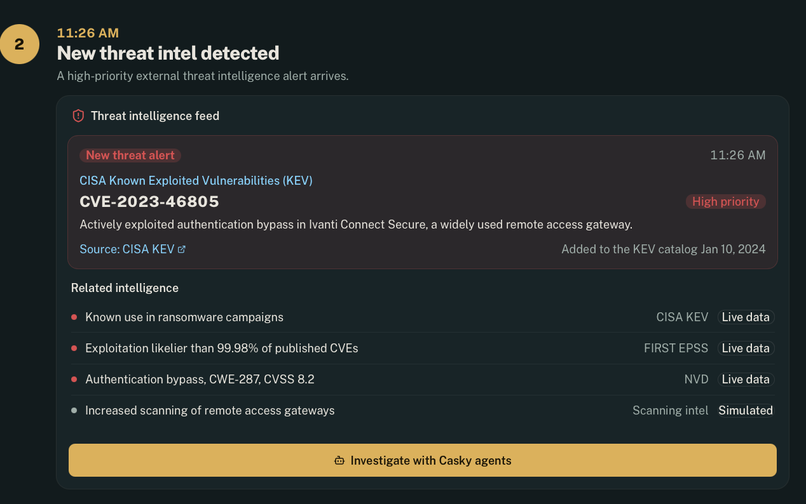

3. **Investigate:** five AI agents investigate in parallel, one per affected service, with real step timestamps.

   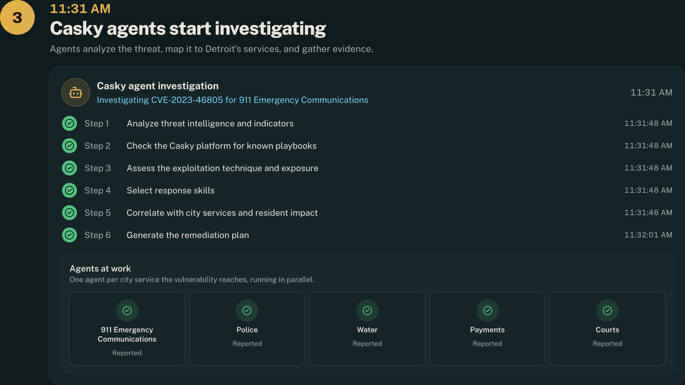

4. **Risk identified:** the risk lands on the map at 911.

   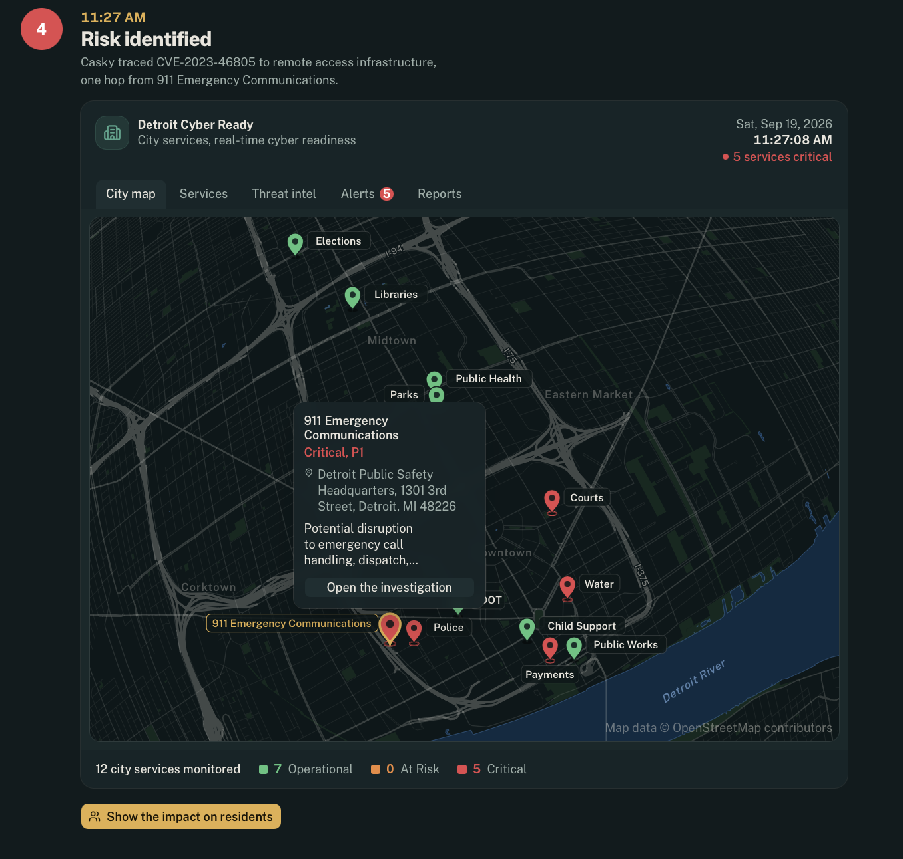

5. **Impact:** the impact analysis shows the score, the evidence, and the resident impact.

   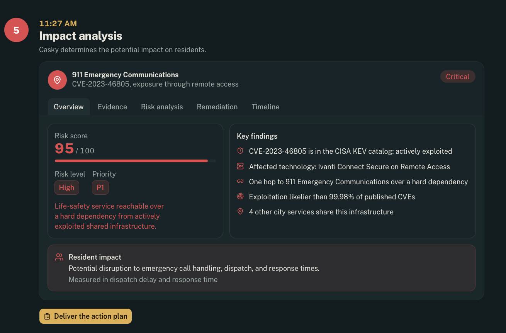

6. **Act:** a ranked action plan with owners and deadlines, an incident ticket, and a CISO alert delivered to Slack.

   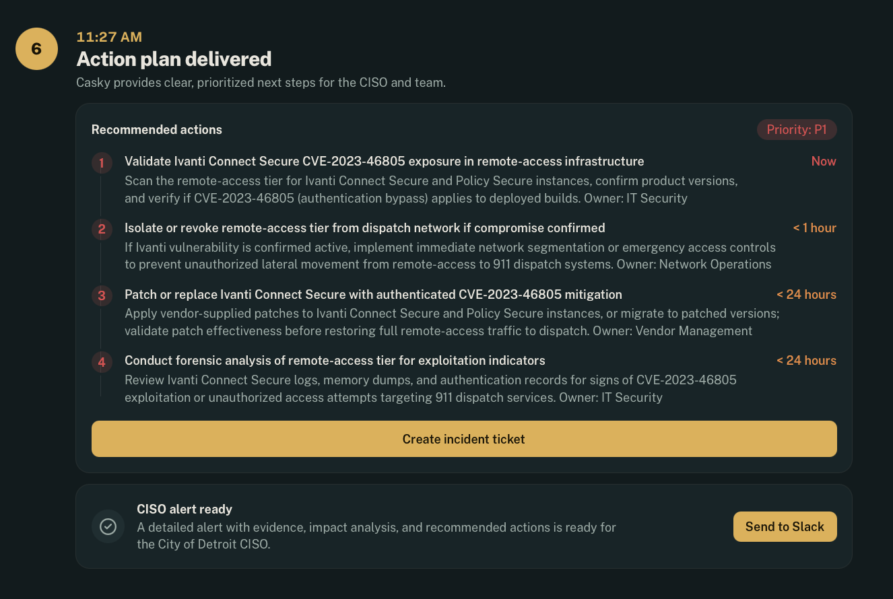

   The CISO alert as it lands in Slack: priority, exposure path, the full action plan, findings, and a timeline, all read from the stored investigation.

   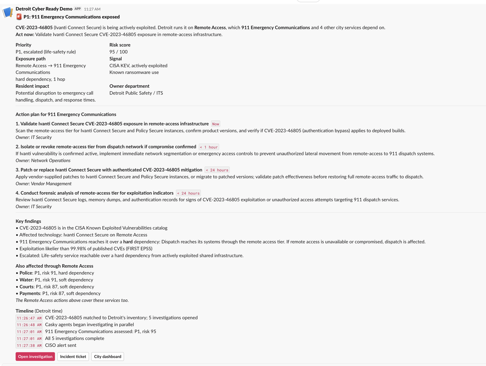

In our live runs, all five investigations complete in under a minute. 185 automated tests cover:

- the exposure match;
- the one-hop dependency logic;
- risk scoring and the life-safety escalation rule;
- the five-layer completion guards;
- the Slack alert contract;
- and a check that no seed data points at a real system.

### 05 Impact: wide opportunity in Detroit, and beyond it

<!-- Team: expanded Impact details to come. -->

In Detroit, the product protects the services residents told Rise Higher they need to reach, anchored on 911. Beyond Detroit, adding a city means adding an inventory file, not writing new code. Cities share the same small set of vendors, so one exploited product often puts many cities at risk at once.

### 06 Market: you know who you serve, and it can sustain itself

- **Who we serve:** a city's CISO and security team first, then the CIO and the department heads who own each service.
- **How it fits:** it consumes the tools a city already pays for (Tenable, its asset inventory, endpoint tooling) instead of replacing them, which removes the rip-and-replace objection. **Tenable is an input, not a competitor.**

---

## How it works

```
DETECT                INVESTIGATE                 ACT
Something             Does it matter to           What should we fix
changed.              Detroit, and to which       right now, and who
                      city service?               owns it?
```

1. **Detect.** Live external threat intelligence: CISA Known Exploited Vulnerabilities, NVD, EPSS, CISA advisories. Plus attack surface change detection.
2. **Match, deterministically.** A newly exploited vendor and product is matched against the city's technology inventory. No model decides whether Detroit is exposed. The match is an auditable database row.
3. **Propagate, one hop.** Most signals do not land on a city service directly. They land on shared infrastructure the service depends on. A remote access appliance is one hop from 911.
4. **Investigate.** An agent pipeline assembles context, validates techniques, and correlates service impact.
5. **Act.** A prioritized action plan with owners and SLAs, and a CISO-ready alert.

**The design principle: the match is deterministic, only the narrative is generated.** The model explains, prioritizes and writes. It never decides whether the city is exposed.

---

## What is real and what is simulated

We are explicit about this because a security product that overstates its inputs is not a security product.

| Layer | Source | Status |
|---|---|---|
| Actively exploited vulnerabilities | CISA KEV | **Real, live** |
| Vulnerability context, CVSS, CPE | NVD | **Real, live** |
| Exploitation probability | FIRST.org EPSS | **Real, live** |
| Advisories | CISA | **Real, live** |
| Street map: roads, parks, Detroit River | OpenStreetMap, built into the app | **Real** |
| Service addresses | Public City of Detroit facility addresses, geocoded | **Real** |
| Which vendor and product each service runs | authored by us | **Simulated, labeled in the UI** |
| Dependencies between services and infrastructure | authored by us | **Simulated, labeled in the UI** |
| External attack surface observations | synthetic source | **Simulated, labeled in the UI** |

**We do not scan cities.** No system in this repository performs reconnaissance against City of Detroit infrastructure or any other real target. Every hostname in the seed data uses an RFC 2606 reserved domain and every address is inside an RFC 5737 documentation range, and there is a test that enforces it.

In production, the inventory is not simulated. A city supplies it, or we ingest it from the Tenable, CMDB and endpoint tooling it already pays for.

---

## Language we do not use

External threat intelligence cannot prove a city is under attack. This product says "new external threat signal," "potential exposure," "evidence of targeting," and "requires investigation." It does not say "you are being hacked."

---

## Upstream dependencies

Every line of Detroit-specific code in this repository was written during the buildathon. The following are consumed as pinned upstream dependencies and are not our work:

| Upstream | How it is consumed | What it provides |
|---|---|---|
| [mukul975/Anthropic-Cybersecurity-Skills](https://github.com/mukul975/Anthropic-Cybersecurity-Skills) | git submodule, pinned | The cybersecurity skills corpus used for investigation step selection |
| Casky platform | HTTPS API, `csk_` key | Investigation playbooks and CVE analysis |
| [casky-ai/casky-runner](https://github.com/casky-ai/casky-runner) | referenced | Execution tier, not wired for this build |
| [OpenStreetMap](https://www.openstreetmap.org/copyright) | build-time download, ODbL | Street, park, and river geometry for the city map |

See `docs/connectors.md` for the full connector contract table and what each one requires to go live.

---

## Running the demo

- Live: https://detroit-cyber-ready-web.vercel.app
- Reset before a presentation: open `/reset`, or use **Reset demo** at the bottom of the dashboard, or run `pnpm demo:reset`.
- Tests: `pnpm test` from the repo root.

See `plans/001_prd.md` for the full product requirements document, architecture, and execution plan.

## License

Apache-2.0
